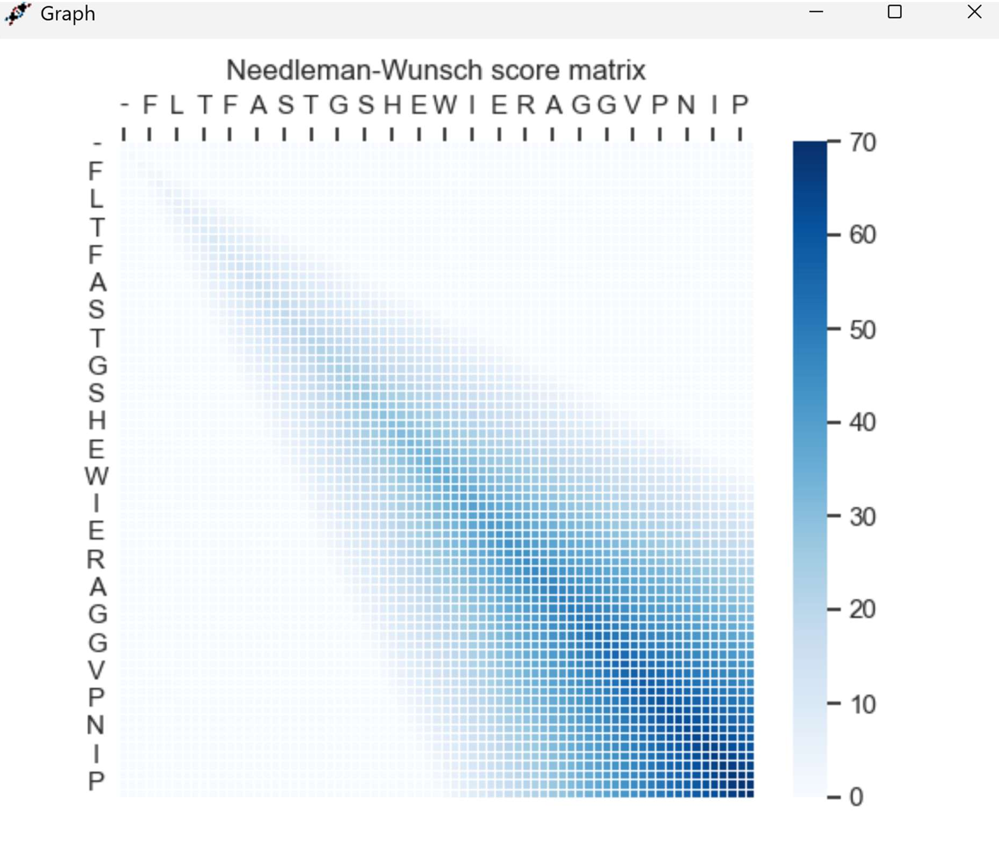

# Needleman-Wunsch Algorithm

A Python application that implements the Needleman-Wunsch algorithm for global sequence alignment. The program features a graphical user interface (GUI) built with CustomTkinter, allowing for easy sequence input, score customization, and visualization of the results.



---

## 🎯 Features

* **Graphical User Interface:** An easy-to-use interface built with `customtkinter` to input sequences and run the alignment.
* **Customizable Scoring:** Set custom scores for **match**, **mismatch**, and **gap** penalties to see how they affect the alignment.
* **FASTA File Support:** Load sequences directly from `.txt` or FASTA-formatted files.
* **Full Alignment Results:** Displays the final aligned sequences (Sequence 1, Sequence 2, and the alignment 'key') along with the optimal alignment score.
* **Matrix Visualization:** Generates and saves a heatmap of the entire scoring matrix using `matplotlib`, helping to visualize how the optimal path was calculated.
* **Robust Error Handling:** Includes custom exceptions for invalid sequence characters or incorrect file formats.

---

## 🛠️ Tech Stack

* **Python**
* **CustomTkinter:** For the UI.
* **Matplotlib:** For plotting the scoring matrix.
* **NumPy:** For matrix operations.
* **Unittest:** For testing the sequence validation logic.

---

## 🚀 How to Run

1.  **Clone the repository:**
    ```bash
    git clone [https://github.com/natalia0sperczynska/Needleman_Wunsch_algorithm.git](https://github.com/natalia0sperczynska/Needleman_Wunsch_algorithm.git)
    cd Needleman_Wunsch_algorithm
    ```

2.  **Install dependencies:**
    ```bash
    pip install -r requirements.txt
    ```

3.  **Run the application:**
    ```bash
    python Main/Main.py
    ```
